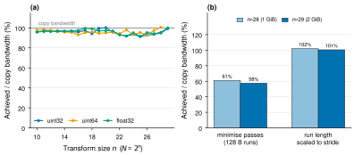
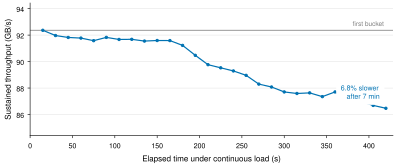
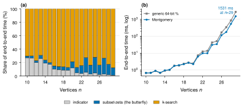

# A templated Yates butterfly kernel in Metal, and exact chromatic number on top of it

**Project:** yates-butterfly · **Date:** 2026-09-27 · **Hardware:** MacBook Air
(Mac16,13), Apple M4, 16 GB unified memory, macOS 26.3 · **Software:** MLX 0.32.2

Two deliverables, built in sequence. First, a single templated Metal kernel that
computes the n-fold Kronecker power of any 2×2 generator matrix by the Yates
algorithm — one kernel covering the Walsh–Hadamard transform, the subset and
superset zeta and Möbius transforms, and the polar-code kernel. Second, an
application that uses it to compute **exact chromatic numbers** by
Björklund–Husfeldt–Koivisto inclusion–exclusion.

Everything below was measured on the machine named above. Nothing is a vendor
figure, an estimate, or a remembered number; every value traces to a JSON
artifact in `data/` and a re-runnable command.

---

## 1. Summary

| | Result |
|---|---|
| **Kernel throughput** | 91.3–100.6% of a device-to-device copy measured on the same machine, across `uint32`/`uint64`/`float32` and n = 10…29. Median ≈ 96%. |
| **Largest transform** | n = 29 (2 GiB per array), 2 GiB in / 2 GiB out, in 174 ms |
| **Exactness** | zeta/Möbius round trips bit-exact over Z/2³² and Z/2⁶⁴; Hadamard bit-loss bound proved *tight* with a witness at every n |
| **Chromatic number** | exact χ for an arbitrary 29-vertex graph in **1.53 s** (`mode="exact"`, `G(29,0.5)`, 3 CRT primes); 28 vertices in 544 ms; runtime depends only on n |
| **Tests** | 1483 passed + 1 skipped in the fast suite, 11 more marked slow, all passing; all six required kernel test groups cover all three element types |
| **Code** | 1.4k lines kernel, 1.7k application, 2.4k tests, 1.3k benchmarks |

The three results I would actually defend as interesting are in §3.2 (a tiling
policy change worth 1.75× at the largest sizes), §4.3 (a *constructed* failure
of the mod-2⁶⁴ soundness argument), and §4.4 (the butterfly turning out not to
be the bottleneck of its own application).

---

## 2. The kernel

### 2.1 What it is

For a 2×2 matrix `M` over a commutative ring, the transform is `M^⊗n` applied to
a vector of length `N = 2ⁿ`, computed in `n·2^(n-1)` butterflies. Stage `j`
pairs each index `i0` whose bit `j` is zero with `i1 = i0 | (1<<j)`:

```
new[i0] = m00·x[i0] + m01·x[i1]
new[i1] = m10·x[i0] + m11·x[i1]
```

The five named variants differ only in those four constants. Stages act on
distinct tensor factors, so they commute and may be grouped freely — which is
what makes the tiling below legal.

Source: [`yates/kernel.metal`](../yates/kernel.metal), [`yates/kernel.py`](../yates/kernel.py),
[`yates/variants.py`](../yates/variants.py).

### 2.2 Three tiers in one kernel

A pass transforms index bits `[s, s+P)`. Its tile is `2^P` rows (stride `2^s`
apart) × `C` contiguous columns, with `G` independent tiles per threadgroup. The
tier of a stage is decided purely by how far apart its butterfly partners are:

| partner lives in | mechanism | cost |
|---|---|---|
| this thread's own registers | array indexing | free |
| another lane of the simdgroup | `simd_shuffle_xor(x, C<<b)` | no memory traffic |
| another thread | threadgroup memory | two barriers per stage |

Nothing about the GPU is hardcoded. The SIMD width is read out of a live kernel
(`threads_per_simdgroup`), the threadgroup memory limit and maximum threadgroup
size come from the Metal device, and the memory ceiling is derived from the
detected recommended working set. All are printed in test and benchmark output.
[`yates/device.py`](../yates/device.py)

Autodiff needs no backward kernel at all: `(M^⊗n)ᵀ = (Mᵀ)^⊗n`, so every VJP is
the same kernel with a transposed generator. [`yates/autodiff.py`](../yates/autodiff.py)

---

## 3. Kernel results



**Figure 1. The kernel is bandwidth-bound across the whole range, once
high-stride passes use long enough contiguous runs.** (a) Achieved bandwidth as
a fraction of a pure device-to-device copy kernel measured on the same machine
at the same working-set size, for n = 10…29. Traffic is
`2·passes·N·sizeof(elem)` with the pass count taken from the plan actually
dispatched. Points slightly above 100% are inter-pass reuse in the system cache.
(b) The tiling-policy change behind that: the pre-fix policy minimised pass
count and left 128-byte runs on passes whose rows are megabytes apart; the
shipped policy scales the required run length with the stride, at the cost of a
fourth device pass. Bar labels are % of copy. Single run per configuration;
each value is the median of the second half of a steady-state measurement
window, with idle cooldown between configurations.
Data: [`bench/results/bench.json`](../bench/results/bench.json), [`bench/results/coalescing_tuning.json`](../bench/results/coalescing_tuning.json).

### 3.1 Bandwidth

| element type | n | transform GB/s | fraction of measured copy |
|---|---|---|---|
| `uint32` | 10–29 | 89.9–98.9 | 91.3%–100.2%, median 95.9% |
| `uint64` | 10–28 | 91.6–99.3 | 92.9%–100.6%, median 95.8% |
| `float32` | 10–29 | 90.6–99.5 | 91.6%–100.0%, median 96.7% |

The denominator deserves emphasis: it is re-measured at **every** working-set
size, because achievable copy bandwidth on this machine ranges from ~49 GB/s at
a 16 MiB footprint to ~104 GB/s at 2 GiB. A single global denominator would
have been meaningless, and quoting the 16 MiB figure as "peak" would have made
the kernel look like it exceeded hardware limits.

### 3.2 The finding worth keeping: run length must scale with stride

A pass at bit offset `s` reads rows `2^s` elements apart. When that stride is
large, every row of a tile lands on a different DRAM page and TLB entry, and
short runs stop amortising the page activation. Measured in one controlled run:

| configuration | n=28, 1 GiB | n=29, 2 GiB |
|---|--:|--:|
| minimise passes, 128 B runs (pre-fix) | 61.0% | 57.5% |
| 4 passes, 512 B runs | 97.7% | 102.1% |
| 4 passes, 1 KiB runs | 95.8% | 102.4% |
| 4 passes, 2 KiB runs | 92.6% | **103.6%** |
| shipped policy (scaled to stride) | **102.1%** | 100.5% |

Spending an extra full pass over 2 GiB to lengthen the runs is a large net win,
and the optimum run length *grows* with n — 512 B at n=28, 2 KiB at n=29. The
shipped policy tracks that automatically and lands within a percent of the best
hand-tuned plan at both sizes. This was the single largest performance change in
the project and it came from measuring, not from reasoning about the kernel.

### 3.3 Thermal behaviour



**Figure 2. Passive cooling costs 6.8% after seven minutes, and macOS reports
nothing.** Sustained throughput during 7 minutes of continuous `WHT` at n = 24
(256 MiB working set, 1.5 GiB of traffic per iteration, 23 834 iterations) with
no cooldown at all, in 15-second
buckets. Each point is the median of its bucket. The grey line is the first
bucket, the reference the slowdown is measured against. **Note the y-axis does
not start at zero** — the claim is the shape of the decline, which spans
86.5–92.4 GB/s. Single run. `pmset -g therm` reported no thermal or performance
warning before or after, so measured throughput is the only usable signal.
Data: [`bench/results/thermal.json`](../bench/results/thermal.json).

Throughput is flat for roughly three minutes and then declines steadily, ending
6.8% down and still falling. This is why the sweep in Figure 1 uses cooldowns
between configurations and reports the median of a window rather than a
best-of-N peak: within a configuration those numbers are steady state, but they
are *not* what the machine sustains over tens of minutes.

### 3.4 The exactness contract

This was the intellectual core of the kernel brief, and it is stated in full in
[`README.md`](../README.md). In summary:

- Unsigned overflow in MSL is defined wraparound, so `uint`/`ulong` arithmetic
  is *exact reduction* mod 2³²/2⁶⁴. Signed overflow is undefined behaviour.
  **Every exact path uses `uint` or `ulong`.** A source lint enforces that
  signed types appear only in compile-time positions, and a behavioural test
  runs inputs with the top bit set — where a signed path would be UB — against
  arbitrary-precision Python.
- The four zeta/Möbius generators are unipotent (SNF = identity), hence exact
  automorphisms of Z/2^k: `MOB_SUB(ZETA_SUB(x)) == x` bit for bit, no tolerance.
- `SNF(H₂) = diag(1,2)`, so `H_(2ⁿ)` has elementary divisors `2^j` with
  multiplicity `C(n,j)`, and a forward-then-inverse WHT recovers the input only
  **mod 2^(k-n)**. `bit_loss()` computes this from the Smith normal form rather
  than hardcoding it per variant, so it is correct for a user-supplied matrix.
- The bound is proved **tight in both directions** by exhibiting, for each n, two
  inputs differing only in bit `k-n` that are indistinguishable after
  `WHT∘WHT`, while a flip at bit `k-n-1` *is* visible.

### 3.5 Platform findings

Three MLX 0.32.2 / `applegpu_g16g` behaviours shaped the implementation. Each
has a test that pins it and *warns* if a future release fixes it.

1. **`metal::simd_shuffle_xor` silently corrupts 64-bit operands** — it operates
   per 32-bit register. This caused a real `uint64` miscompare during
   development; `ulong` is now shuffled as two halves.
2. **MLX pastes template integers into the generated Metal identifier**, so a
   negative value emits an invalid C++ name and the library fails to build.
   Matrix entries are carried as `(sign, magnitude)` pairs instead.
3. **`custom_function` `.jvp` and `.vmap` rules are bypassed for kernel bodies.**
   MLX consults the registered `.vjp` but descends into the `CustomKernel` for
   the other two. Reverse mode — what the brief required — works; forward mode
   and `vmap` are documented as unsupported rather than papered over with dead
   rules.

A fourth, relevant to anyone benchmarking MLX: `mx.contiguous()` on a prefix
slice is a real device copy, not a no-op. Measuring inside that copy halved
every bandwidth number until I caught it.

---

## 4. Exact chromatic number

With `a(S) = [S independent]`:

```
i(S) = (ZETA_SUB a)(S)                 # independent subsets of S
c_k  = Σ_S (-1)^(n-|S|) · i(S)^k       # ordered k-tuples of independent
                                       # sets whose union is V
χ(G) = min { k : c_k > 0 }
```

One subset-zeta over the whole cube, shared by every `k` and every modulus; then
a pointwise power and a reduction per candidate `k`, with a binary search between
a greedy-clique lower bound and a DSATUR upper bound. `O*(2ⁿ)` for every graph,
no search over colourings. [`apps/chromatic/README.md`](../apps/chromatic/README.md)

### 4.1 Correctness

Every family with a published chromatic number is reproduced: `K_n`, complete
bipartite, even/odd cycles, paths, Petersen (two independent constructions,
checked isomorphic), Chvátal, Grötzsch, the Mycielskian chain M₂–M₅, Kneser
`K(n,2)` against Lovász, Turán graphs. Random `G(n,p)` up to n = 12 is checked
against an exhaustive backtracking oracle, which is *itself* validated against
unpruned `kⁿ` enumeration for n ≤ 8.

The Mycielskians are the family that matters: χ(M_k) = k while the clique number
stays at 2, so every clique-based bound is useless and the method has to do the
work. M₅ (23 vertices, χ = 5) resolves in 25.5 ms.

### 4.2 The modulus design question

The brief suggested the kernel could run mod p "with a trivially different
generator, or with a post-pass reduction". **Both are wrong**, and
[`tests/chromatic/test_modulus_design.py`](../tests/chromatic/test_modulus_design.py) demonstrates each:

- A generator is a matrix over the element ring; reduction mod p is a property
  of the *ring* and is not a function of the residue mod 2⁶⁴, so no choice of
  four constants produces it.
- A post-pass reduction is too late at 62-bit primes: the dispatcher fuses up to
  13 stages per device pass and Möbius values can double per stage, so an
  intermediate reaches 2⁷⁵ before the first pass boundary.

What works, with **no kernel change at all**, is to keep primes under 2³¹ so the
entire transform is exact over ℤ and reduce once at the end. The zeta runs in
`uint32` (since `i(S) ≤ 2ⁿ`) and is exact outright; the alternating sum of `2ⁿ`
terms each `< 2³¹` stays below 2⁶³, so the unmodified `uint64` kernel returns the
exact integer in two's complement. A test violates that bound deliberately and
shows the reading break, so the condition is established as necessary, not just
sufficient.

This is a smaller modulus than the brief proposed, which weakens the per-prime
failure bound; §4.3 accounts for that. In exchange the kernel is reused verbatim
and all of its own measured numbers stay valid.

### 4.3 The one-sided guarantee, and a constructed counterexample

`c_k` is a count, so the two directions are not symmetric:

- `c_k mod m ≠ 0` ⟹ `c_k ≠ 0` ⟹ G is k-colourable. **Sound for any m.**
- `c_k mod m = 0` ⟹ either `c_k = 0` *or* `c_k` is a nonzero multiple of `m`.
  **False negative possible.**

So `min{k : c_k mod 2⁶⁴ ≠ 0}` is an **upper bound** on χ, not χ. It is always
achievable — a colouring realising it is attached — but not a proof of
minimality. Nothing in the code calls the single-modulus result exact.

**This is not hypothetical, and that is the result I am most pleased with.**
`c_k` is multiplicative over disjoint unions and `v₂(c₃₀(K₄)) = 10`, so **seven
disjoint copies of K₄ — 28 vertices, inside the memory ceiling — give
`v₂(c₃₀) = 70`**. `c₃₀` is a 149-digit number and `c₃₀ mod 2⁶⁴ = 0`: the
single-modulus test reports "not 30-colourable" for a graph that obviously is.
Pinned as a test, with an 8-vertex analogue against a 2¹⁶ modulus for the fast
suite. The knapsack that finds it is `bench/chromatic/false_negative_search.py`;
[`bench/results/chromatic_false_negative.json`](../bench/results/chromatic_false_negative.json).

**Can a false negative corrupt the reported χ?** That needs the failure at
`k = χ` itself, i.e. `2⁶⁴ | c_χ`. My first answer was a search — "not found
across 287 graphs, best ratio `v₂(c_χ)/n = 7/8` suggests n ≥ 74". That was the
wrong instrument: the ratio is not constant, so extrapolating it proves nothing.
There is an exact answer.

**Lemma.** `χ! | c_χ(G)` for every graph G. *Proof.* If a covering
`(S₁,…,S_χ)` had `Sᵢ = S_j` for `i ≠ j`, dropping `S_j` would still cover V,
giving a covering by `χ−1` independent sets and hence `(χ−1)`-colourability —
contradicting minimality. So the components are pairwise distinct, `S_χ` acts
**freely** on the coverings by permuting coordinates, every orbit has size `χ!`,
and `χ!` divides their number. ∎

The lemma is **tight on cliques** (`c_n(K_n) = n!`, since every slot must hold a
distinct singleton), so by Legendre `v₂(n!) = n − popcount(n)` the first clique
with `2⁶⁴ | c_χ` is exactly **`K₆₆`**: `v₂(66!) = 66 − 2 = 64`, while
`v₂(65!) = v₂(64!) = 63`. `K₆₆` is a counterexample at `k = χ` by arithmetic,
not by search.

This makes the practical claim **stronger** — but it has to be stated
**additively**, because `c_k` is multiplicative over connected components and so
`v₂` is additive. The lemma applies to a component only at `k = χ(component)`:

    forced(G) = #{components with χᵢ = χ(G)} · v₂(χ!)

Components below χ are evaluated at `k > χᵢ`, where the action is not free, so
they force nothing. The connected formula applied to a disconnected graph
understates badly: **seven disjoint K₄** has `c₄ = (4!)⁷`, `v₂ = 21` — all
forced, each component's cofactor being 1 — where `v₂(χ!) = 3` alone would
account for three.

A component attaining χ needs ≥ χ vertices, so `m·χ ≤ n` and the maximum forced
part over all graphs on ≤ n vertices is `max_{m·χ≤n} m·v₂(χ!)`. **At n = 29 that
is 25**, attained by one connected component with χ = 28 or 29 — allowing
disconnected graphs does not raise it. (The value 25 was right; the formula
behind it was not.)

So ≥ **39 of the 64 bits** must come from the unforced part. Over a 156-graph
survey, 57 of them disconnected:

| `v₂` of the unforced part | 0 | 1 | 2 | 3 | 4 |
|---|--:|--:|--:|--:|--:|
| observed | 92.3% | 4.5% | 1.9% | 0.6% | 0.6% |
| a "random" integer, `2^-(j+1)` | 50% | 25% | 12.5% | 6.25% | 3.13% |

The bias toward oddness, not merely the absence of large values, is the
evidence. Two things are recorded as unproved: that `|X| ≡ |X^P| (mod 2)` for a
Sylow 2-subgroup of `Aut(G)` acting on the unordered covers *explains* that bias
(the congruence itself is a standard theorem, verified here on 15 graphs by
brute-force automorphism enumeration, but it implies nothing about how often
`|X^P|` is odd); and the conjecture `v₂(c_χ) ≤ n`, whose tightest witnesses are
K₆₆ (64 of 66) and seven disjoint K₄ (21 of 28).

Credit where due: the lemma and the `K₆₆` computation came from review of the
first draft of this report, not from me.

Two ways to close the gap, both implemented:

- **Multi-modular.** r random primes from `[2³⁰, 2³¹)`; failure probability
  ≤ `(D/M)^r` with `D ≤ log(c_k)/log(2³⁰)` divisors and, by Rosser–Schoenfeld,
  `M = π(2³¹) − π(2³⁰) > 3.5·10⁷`. The assumption is that primes are drawn
  independently of the instance.
- **CRT, unconditional.** `0 ≤ c_k ≤ i(V)^k` and `i(V)` is already computed (it
  is the top entry of the zeta), so once the moduli product exceeds `i(V)^k` the
  reconstruction is exact and no probability remains. This is far cheaper than
  "small n" suggests: the Chvátal graph has 127 independent sets, so
  `c₄ ≤ 127⁴ < 2²⁸` and **one 31-bit prime already suffices**. Hence
  `mode="exact"` is the default and every ground-truth test asserts
  `result.certain`.

### 4.4 Where the time actually goes



**Figure 3. The butterfly is not the bottleneck of its own application.**
(a) Share of end-to-end time by phase, n = 10…29 on random `G(n, 0.5)`. The
subset-zeta — the entire point of the kernel — is 3–24% of runtime; the k-search
is 69–88%. Phases are measured as nested prefixes of the real computation
(indicator; indicator+zeta; end-to-end) and the inner ones subtracted, so the
three shares sum to the measured total by construction. (b) End-to-end time,
log scale, before and after replacing the generic 64-bit `%` in the modular
power with Montgomery reduction. Single run per point, median of a steady-state
window, idle cooldown between configurations.
Data: [`bench/results/chromatic.json`](../bench/results/chromatic.json), [`bench/results/chromatic_pre_montgomery.json`](../bench/results/chromatic_pre_montgomery.json).

The reason is structural: the zeta runs **once**, over a `uint32` array, while
the k-search runs one power-plus-reduction *per CRT prime per candidate k* over
`uint64` arrays twice the width. More passes over more bytes.

Chasing that led somewhere useful. The 64-bit `%` in the square-and-multiply
loop was compute-bound, and Montgomery reduction with R = 2³² removes the
division entirely:

| pointwise power variant (n=26, k=6, 768 MiB/pass) | time | effective GB/s |
|---|--:|--:|
| mod 2⁶⁴, no reduction (bandwidth floor) | 7.88 ms | 102.2 |
| mod p, generic 64-bit `%` | 30.67 ms | 26.3 |
| mod p, Montgomery | 12.83 ms | 62.8 |
| *the subset-zeta at the same n, for scale* | 16.15 ms | 99.7 |

**2.39×** in the controlled comparison; end to end n = 29 went from 2778 ms to
1531 ms. It remains short of the bandwidth floor, so the power kernel is still
partly compute-bound — the Montgomery multiply chain itself, not division.
Data: [`bench/results/chromatic_modmul.json`](../bench/results/chromatic_modmul.json).

### 4.5 Cost against density

The n-sweep holds density at 0.5, which is the wrong axis for the cost of exact
mode: that scales with the CRT prime count, hence with `k·log₂ i(V)`. The two
factors pull against each other — sparse graphs have many independent sets but
small χ, dense graphs the reverse — so which end is worst is empirical. At
n = 26 (`bench/chromatic/density.py`, [`bench/results/chromatic_density.json`](../bench/results/chromatic_density.json)):

| density `p` | edges | i(V) | log₂ i(V) | chi | k tested | CRT primes at chi | `mode="exact"` | `mode="mod2_64"` |
|--:|--:|--:|--:|--:|--:|--:|--:|--:|
| 0.05 | 18 | 2,017,280 | 20 | 2 | 1 | 2 | 64 ms | 34 ms |
| 0.10 | 31 | 283,518 | 18 | 3 | 2 | 2 | 107 ms | 46 ms |
| 0.15 | 47 | 81,717 | 16 | 3 | 1 | 2 | 63 ms | 33 ms |
| 0.20 | 67 | 21,447 | 14 | 4 | 2 | 2 | 112 ms | 47 ms |
| 0.30 | 91 | 6,692 | 12 | 5 | 1 | 3 | 87 ms | 33 ms |
| 0.50 | 150 | 969 | 9 | 6 | 2 | 2 | 117 ms | 46 ms |
| 0.70 | 222 | 236 | 7 | 9 | 2 | 3 | 170 ms | 47 ms |
| 0.90 | 295 | 61 | 5 | 15 | 1 | 3 | 96 ms | 34 ms |

**Within `G(n,p)` the prime count never leaves 2–3 and the range spans 2.7× in
wall clock.** `χ·log₂ i(V)` stays in 40–75 bits, self-limiting *for random
graphs*: `α ~ 2 log_b n` gives `χ ~ n/(2 log_b n)` and `log₂ i(V) = Θ(log² n)`,
so the product is `Θ(n log n)` rather than `Θ(n²)`.

**That does not extend to all graphs.** The driver is heterogeneity, not
density. For `K_a + E_b` (clique beside an independent set, `n = a+b`), `χ = a`
and `i(V) = (a+1)2^b`, so the product is `Θ(n²)` near `a ≈ n/2` — and `G(26,0.5)`
reaches such a graph with probability zero:

| `a` (so `b = 26 − a`) | i(V) | log₂ i(V) | chi | bound bits | CRT primes | `mode="exact"` |
|--:|--:|--:|--:|--:|--:|--:|
| 2 | 50,331,648 | 25 | 2 | 41 | 2 | 72 ms |
| 4 | 20,971,520 | 24 | 4 | 97 | 4 | 109 ms |
| 8 | 2,359,296 | 21 | 8 | 169 | 6 | 158 ms |
| 12 | 212,992 | 17 | 12 | 212 | 8 | 203 ms |
| 13 | 114,688 | 16 | 13 | 218 | 8 | 205 ms |
| 16 | 17,408 | 14 | 16 | 225 | 8 | 227 ms |
| 20 | 1,344 | 10 | 20 | 207 | 7 | 202 ms |
| 24 | 100 | 6 | 24 | 159 | 6 | 179 ms |

**Eight primes against two or three**, and the slot bound does not help here
(338 bits at a=13, worse than the 218 it replaces). Still only 227 ms, so no
practical harm, but the headline must name the family. Two details worth
keeping apart: the planner sizes from a *bound*, so at a=13 it is the 218-bit
bound rather than the 201.5-bit true `c₁₃ = 13!(2¹³−1)¹³` that buys the eighth
prime; and the worst bound (a=12) and worst true value (a=16) do not coincide.
The family doubles as exact ground truth — `c_k(K_a + E_b)` is closed-form for
every k, derived in the test rather than quoted.

### 4.6 Honest positioning### 4.6 Honest positioning

`O*(2ⁿ)` for every graph cuts both ways.

- **Where it wins:** small, dense, hard instances, and any instance where
  branch-and-bound blows up. Runtime depends only on n, never on instance
  hardness. Triangle-free graphs with large χ are trivial for it.
- **Where it is useless:** the large sparse DIMACS benchmarks. Specialised
  branch-and-bound colouring solvers handle hundreds of vertices there; this
  cannot handle 40 on any machine — `2⁴⁰` uint32 words is 4 TiB.

**It is not competitive with colouring solvers in general and is not offered as
such.** The supportable claim is narrower: *exact chromatic number for arbitrary
graphs up to ~28 vertices, in time depending only on n, on a passively cooled
laptop.*

---

## 5. Things I got wrong, and limitations

Worth recording, because some of these were caught only by measurement:

- **Two README claims contradicted by my own data.** I wrote that the GPU
  indicator always beats the NumPy O(2ⁿ) DP — the DP is actually *faster* below
  n ≈ 15, where the GPU is launch-overhead-bound at a flat 0.18 ms. And I wrote
  that the early-exit and branchless indicator kernels were within noise — the
  early exit is worth **3.4×** at n = 29. Both corrected.
- **A real design flaw in the modular driver.** Folding the mod-2⁶⁴ residue into
  the "all residues agree" consistency check made a *detected false negative*
  look like an inconsistency, which would have aborted the solver on the very
  instance that demonstrates the failure mode. Caught by the slow test; prime
  agreement and false-negative detection are now separate concepts.
- **A benchmark artifact that inverted a table.** A 5-sample cap starved the
  sub-millisecond small-n phases of samples, and the derived shares exceeded
  100%. Sampling is now governed by the time budget, and rows whose phase
  prefixes fail to nest are flagged.
- **A traceability gap I had to go back and close.** The coalescing before/after
  table originally cited a script that, after the policy change, no longer
  produced the "before" number. The pre-fix plan is now an explicit candidate.
- **The brief's own traffic model is internally inconsistent** — it asks for
  "fusing as many stages per pass as the tile size allows" *and* quotes the
  unfused `2(n−t)2ⁿ` traffic figure. The implementation follows the former
  (3 passes at n = 24 rather than 13) and the README flags the discrepancy.
- **Measurement discipline.** Every number is a single run — the median of a
  steady-state window, not a mean over seeds. There is no seed-variance estimate
  anywhere, and run-to-run spread of a few percent is visible in the data (the
  same configuration measured 82.2% and 67.4% of copy in two different early
  runs). Claims of a few percent should not be read as resolved.
- **Small-n batching.** Transforms with n < 5 and a large batch dispatch fewer
  than one full simdgroup per tile. Correct, not bandwidth-optimal, and outside
  everything benchmarked.
- **Three claims corrected in review, all of them mine.** (i) The
  `(2^k−1)^n` tightening is a closed form `1 + log₂(1−2^-k)/k = Θ(2^-k/k)`, not
  an empirical 10–20%; my own table was already its values. (ii) The forced
  valuation is per-component and additive — the connected formula understates
  seven disjoint K₄ by 18 bits, though the bound of 25 at n ≤ 29 survives.
  (iii) "No sparse worst case" was right for `G(n,p)` and wrong in general: the
  extremum is heterogeneous, and `K_a + E_b` needs 8 primes where `G(n,p)` needs
  2–3. In each case I had generalised from the sample I happened to measure.
- **I reached for a search where a theorem was available.** The `2⁶⁴ | c_χ`
  question (§4.3) is settled exactly by the free-action lemma; I instead
  surveyed 287 graphs and extrapolated a ratio that is not constant. The
  conclusion happened to be right and conservative, but the argument was weak,
  and the replacement bounds the forced part at 25 of 64 bits instead.
- **I fixed the density axis only after it was pointed out.** §4.5 exists
  because the n-sweep at fixed `p = 0.5` describes one slice of the space; the
  answer turned out to favour the method, but that was luck, not design.
- **One cosmetic wart:** commits `7e5811d` and `3a60b87` carry the same message,
  from a backgrounded chain that committed after I had already checked and
  re-committed. No content was lost or duplicated; history is just untidy.

---

## 6. Reproducing this

```sh
python3 -m venv .venv && .venv/bin/pip install -r requirements.txt
.venv/bin/python -m pytest                    # 1483 fast tests
.venv/bin/python -m pytest -m slow            # 11 multi-GiB tests

# kernel
.venv/bin/python bench/bench.py            --out bench/results/bench.json
.venv/bin/python bench/thermal.py          --minutes 7 --out bench/results/thermal.json
.venv/bin/python bench/tune_coalescing.py  --out bench/results/coalescing_tuning.json

# application
.venv/bin/python bench/chromatic/bench.py                 --out bench/results/chromatic.json
.venv/bin/python bench/chromatic/modmul.py                --out bench/results/chromatic_modmul.json
.venv/bin/python bench/chromatic/false_negative_search.py
.venv/bin/python bench/chromatic/density.py --out bench/results/chromatic_density.json

# figures in this report (isolated env; they read only the JSON in data/)
cd docs/figures && uv run --no-project --with matplotlib --with numpy python kernel-bandwidth.py
```

The figure scripts read the tracked benchmark output in `bench/results/`
directly, so there is one copy of each result in the repository rather than two
that can drift. A self-contained snapshot (report, figures and a frozen copy of
the JSON) also exists outside the repository as a project artifact.

**Provenance.** Repository `main` at `c1d4437`. MLX 0.32.2, pinned in
[`requirements.txt`](../requirements.txt). Apple M4 GPU (`applegpu_g16g`), SIMD width 32
measured in-kernel, 32768 B threadgroup memory, 11.84 GiB recommended working
set. No thermal or performance warning was recorded by macOS during any run.
